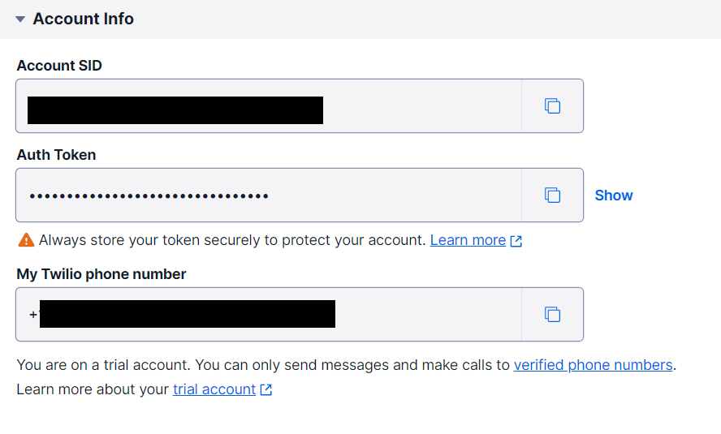
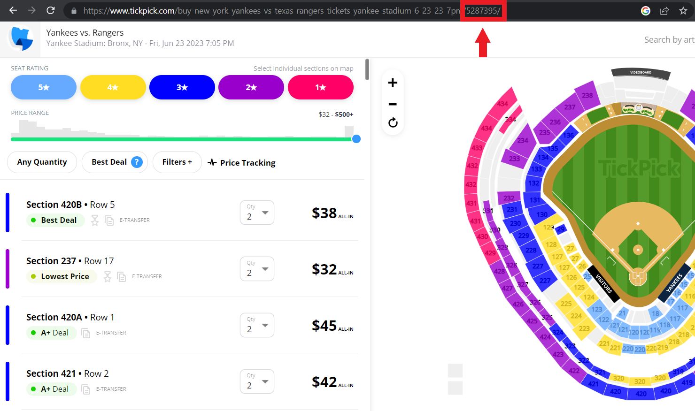

# Concert Ticket Text Message Alerting

Use Tick Pick API &amp; Twilio to set up text message alerts for ticket availability based on user provided parameters.

## Getting Started

### Twilio API Set Up 📱 

[Sign Up for Free Twilio Account & Get Credentials](https://www.twilio.com/docs/usage/tutorials/how-to-use-your-free-trial-account)

_Keep these three values close, you will need them in your `.env` file._



### Tick Pick Event ID 🎵🏈

Navigate to your event on [tickpick.com](https://www.tickpick.com)

Your event ID will be at the very end of the URL for your event.



### Set up your `.env` file

Create a `.env` file at the same directory level as this README. It should have the following format.

```
TWILIO_ACCOUNT_SID=xxxxxx
TWILIO_AUTH_TOKEN=xxxxxxx

TWILIO_PHONE_NUMBER=+111111111
YOUR_PHONE_NUMBER=+11111111

EVENT_ID=1234567
```

- `TWILIO_ACCOUNT_SID`, `TWILIO_AUTH_TOKEN` & `TWILIO_PHONE_NUMBER` should come from your Twilio account

- `YOUR_PHONE_NUMBER` is the number you would like the SMS message to be sent to

- `EVENT_ID` can be found by following [these steps](#tick-pick-event-id-)

## OPTION 1: Run Python Script in CLI 💻

**Step 1:**

`pip install -r requirements.txt`

**Step 2:**

`python ticket_sms_alert.py`

**Step 3:**

Follow the CLI prompts; all responses should be integers.


## OPTION 2: Run Python Script in Docker Container 🐳 

**Step 1:**

`docker build --tag ticket-tracker:latest .`

**Step 2:**

When using Docker, pass the ticket requirements into the `docker run` command. All arguments should be integers.

`docker run ticket-tracker [number of tickets] [maximum price] [frequency of ticket check (mins)]`

Example: `docker run 2 150 10` will search for 2 tickets under $150 every 10 minutes

>Note: Regardless of which option you choose, your Python script will continue running and checking for tickets at the time interval you specify until you manually stop it.
